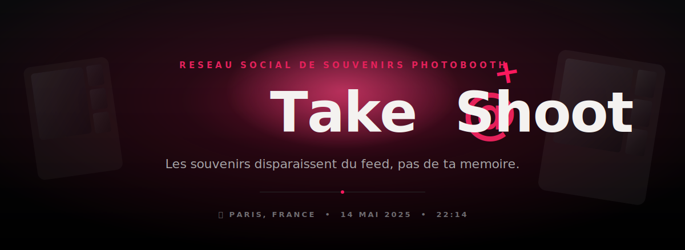
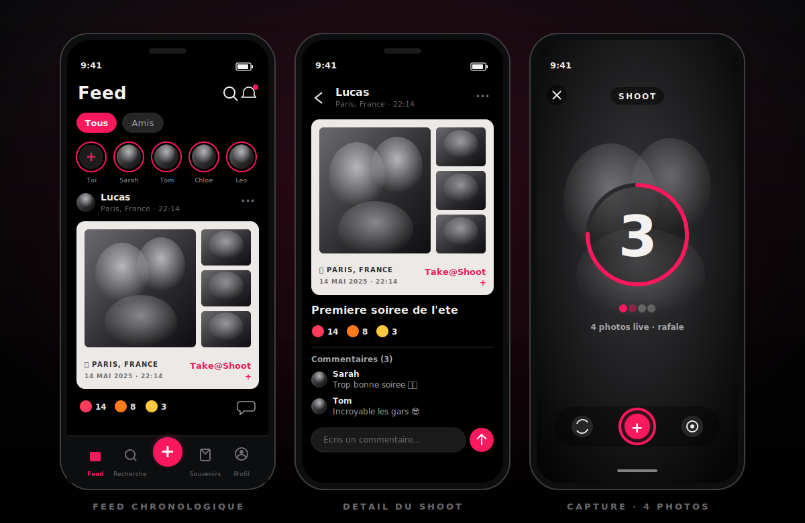
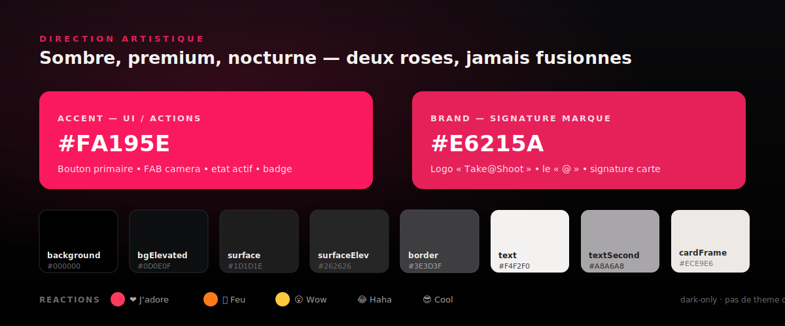
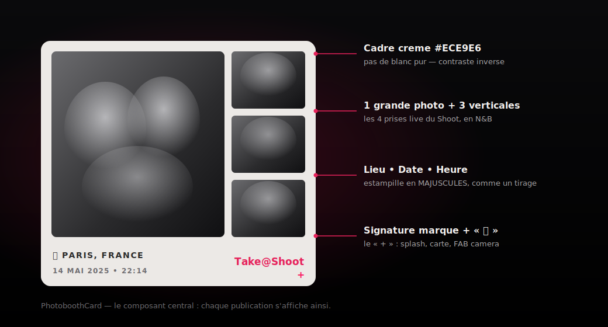

<div align="center">



<br/>


</div>

---

## ✨ C'est quoi Take@Shoot ?

**Take@Shoot** est un réseau social mobile de **souvenirs instantanés**. Il reprend la spontanéité de BeReal, mais l'objet central n'est pas une simple photo : c'est un **souvenir photobooth** _(photomaton)_ numérique.

C'est un **réseau fermé entre potes acceptés** qui capturent des moments réels et les transforment en souvenirs esthétiques. Les publications **disparaissent du feed après 24 h** mais restent pour toujours dans ton **archive privée**.

> **« Les souvenirs disparaissent du feed, pas de ta mémoire. »**

Take@Shoot **n'est pas** un réseau de créateurs, un réseau de performance, un feed de découverte publique, ni une app de selfies.

> 📄 La référence produit & architecture validée vit dans
> [`docs/superpowers/specs/2026-06-06-take-a-shoot-mvp-design.md`](docs/superpowers/specs/2026-06-06-take-a-shoot-mvp-design.md).

---

## 👀 Aperçu

> Maquettes représentatives de la direction artistique — feed chronologique entre potes, détail d'un Shoot, et capture en rafale.

<div align="center">

</div>

<table>
<tr>
<td width="33%" valign="top">

**📰 Feed**
Strictement chronologique, **potes uniquement**. Aucun algorithme, aucune suggestion, aucune pub. Tout s'affiche en carte photobooth.

</td>
<td width="33%" valign="top">

**🔍 Détail d'un Shoot**
La carte signature, puis les 4 photos sources. Réactions nommées et commentaires à un niveau de réponse.

</td>
<td width="33%" valign="top">

**📸 Capture**
4 photos **live** en rafale, caméra avant ou arrière, **aucun import galerie**. Le geste central de l'app.

</td>
</tr>
</table>

---

## 🎨 Direction artistique

Ambiance **sombre, premium, nocturne / fête**. Fond noir OLED, surfaces gris très foncé, un **accent rose/magenta vif**, et des photos traitées en **noir & blanc** dans la carte signature. L'app mobile est **verrouillée en mode sombre** — pas de variante claire.

<div align="center">

</div>

**Deux roses cohabitent volontairement — à ne jamais fusionner :**

| Token | Hex | Rôle |
| --- | --- | --- |
| `accent` | `#FA195E` | **UI & actions** — bouton primaire, FAB caméra, état actif, badge notif. |
| `brand` | `#E6215A` | **Signature de marque uniquement** — logo « Take@Shoot », le « @ », annotations. |

> 🎯 Source de vérité visuelle : [`docs/design/design-system.md`](docs/design/design-system.md), implémentée dans [`packages/ui/src/tokens.ts`](packages/ui/src/tokens.ts) (échantillonnée pixel par pixel sur les mockups).

---

## 🎞️ La carte photobooth — l'objet signature

Chaque publication s'affiche en **carte photobooth** : un **cadre crème** (`#ECE9E6`, jamais blanc pur), une grande photo et trois clichés verticaux — les **4 prises du Shoot**, en noir & blanc. Le pied de carte estampille **lieu • date • heure** en majuscules, comme un vrai tirage, avec la **signature de marque** et le « + ».

<div align="center">

</div>

---

## 🎯 Le MVP en un coup d'œil

| Domaine | Ce que livre le MVP |
| --- | --- |
| **Auth & identité** | Email + mot de passe ; profil public obligatoire avec un `@pseudo` unique |
| **Onboarding** | **MugShoot** obligatoire (4 photos live en rafale) à l'inscription |
| **Graphe social** | Réseau entre potes — recherche par `@pseudo`, demande / acceptation, amitié réciproque |
| **Capture** | Un **Shoot** = 4 photos live, caméra avant / arrière, aucun import galerie |
| **Rendu** | Preview locale rapide sur mobile + rendu officiel canonique côté backend |
| **Templates & filtres** | 1 template photobooth officiel, filtres **Vintage** & **Noir & Blanc** (versionnés, extensibles) |
| **Feed** | Chronologique, potes uniquement ; Shoots visibles 24 h puis archivés en privé |
| **Engagement** | 1 réaction active par Shoot, commentaires à 1 niveau de réponse, tags de potes |
| **Souvenirs** | Archive privée de tes Shoots + section privée `Identifié·e` |
| **Localisation** | Ville / pays, lieu optionnel, FR / EN / ES |
| **Modération** | Blocage, signalement, soft delete, back-office admin, alertes auto non bloquantes |

**Réactions** ❤️ J'adore · 🔥 Feu · 😮 Wow · 😂 Haha · 😎 Cool — une seule active par Shoot.

> 🚫 **Hors périmètre MVP** : feed public, classement algorithmique, pubs, suggestions d'amis, import de contacts, DMs, stories, groupes, vidéos, IA créative, carte interactive. L'onglet **« Proches » est aussi hors MVP** (feed = Tous / Amis).

---

## 🧱 Architecture du monorepo

```text
take-a-shoot/
├── apps/
│   ├── mobile/        # App Expo + React Native (Expo Router) — le produit
│   └── admin/         # Back-office Next.js (modération & support)
├── packages/
│   ├── shared/        # Contrats produit : types, schémas Zod, constantes (réactions, filtres, templates)
│   └── ui/            # Tokens de design partagés
├── supabase/          # Projet Supabase local (config, migrations, functions)
├── docs/              # Documentation produit, design, architecture & setup
│   ├── design/        # design-system.md (DA & tokens)
│   ├── architecture/  # monorepo.md, supabase.md
│   ├── setup/         # environment.md, local-development.md
│   └── superpowers/   # specs & plans validés
├── turbo.json         # Pipeline Turborepo
├── biome.json         # Formateur & linter
└── pnpm-workspace.yaml
```

Le monorepo garde une **source de vérité unique** pour les contrats produit : l'app mobile, l'admin et le backend ne divergent jamais.

---

## 🛠️ Stack technique

| Couche | Technologies |
| --- | --- |
| **Mobile** | React Native · Expo · Expo Router · TypeScript |
| **Admin** | Next.js · React · TypeScript |
| **Backend** | Supabase (Postgres · Auth · Storage · Edge Functions) |
| **Autorisation** | Row Level Security (RLS) Postgres |
| **Code partagé** | Types TypeScript · schémas de validation Zod · tokens de design |
| **Outillage** | pnpm workspaces · Turborepo · Biome · GitHub Actions CI |

---

## 🚀 Démarrage rapide

### Prérequis

- **Node.js** `>= 22.12.0`
- **pnpm** `>= 10` (via Corepack — `packageManager` est épinglé dans `package.json`)
- **Git**
- **Docker Desktop** (pour faire tourner Supabase en local)

### 1. Installer

```powershell
corepack enable
corepack prepare pnpm@latest --activate
pnpm install
```

### 2. Configurer l'environnement

Copie les fichiers d'exemple et renseigne tes clés Supabase locales (**ne jamais committer de vrais secrets**) :

```powershell
Copy-Item .env.example .env
Copy-Item apps/mobile/.env.example apps/mobile/.env
Copy-Item apps/admin/.env.example  apps/admin/.env.local
```

> 📘 Référence complète des variables : [`docs/setup/environment.md`](docs/setup/environment.md).
> ⚠️ `SUPABASE_SERVICE_ROLE_KEY` ne doit **jamais** quitter le code serveur de l'admin — jamais dans le client mobile.

### 3. Lancer Supabase (local)

```powershell
pnpm supabase:start     # démarre la stack locale
pnpm supabase:status    # affiche les URLs et clés locales
pnpm supabase:types     # génère les types TS du schéma dans packages/shared
```

Copie les clés affichées par `supabase:status` dans les fichiers `.env` des apps.

### 4. Lancer les apps

```powershell
pnpm dev                      # toutes les tâches dev via Turborepo
pnpm --dir apps/mobile dev    # app Expo seule
pnpm --dir apps/admin dev     # admin Next.js seule
```

> 🧭 Pas à pas détaillé : [`docs/setup/local-development.md`](docs/setup/local-development.md).

---

## 📜 Scripts

À lancer depuis la racine du repo :

| Commande | Description |
| --- | --- |
| `pnpm dev` | Toutes les tâches dev (Turborepo) |
| `pnpm build` | Build de toutes les apps & packages |
| `pnpm lint` | Lint du workspace |
| `pnpm typecheck` | Vérification de types |
| `pnpm test` | Tests |
| `pnpm format` | Formatage Biome (écriture) |
| `pnpm format:check` | Vérification du formatage |
| `pnpm check` | Check combiné Biome |
| `pnpm supabase:start` / `:stop` / `:status` | Gestion de la stack Supabase locale |
| `pnpm supabase:types` | Régénère les types du schéma DB |

**Vérifier avant de pousser :**

```powershell
pnpm typecheck
pnpm lint
pnpm build
```

---

## 🔐 Notes d'architecture

- **L'identité est dédoublée** — l'identité d'auth (email/mot de passe) est séparée de l'identité publique (`@pseudo`).
- **La confidentialité est imposée côté serveur** — les policies **RLS** appliquent la visibilité entre potes, la propriété, l'accès aux tags et les archives privées. Les checks côté client ne suffisent jamais.
- **Le média suit le même modèle d'autorisation** que les lignes de base de données ; les originaux ne sont jamais exposés comme fichiers publics.
- **Templates & filtres sont versionnés** — un Shoot publié garde l'identité template/filtre choisie, pour que les ajouts futurs n'altèrent pas les souvenirs existants.
- **Soft delete partout** — le contenu est masqué immédiatement puis purgé après une fenêtre de rétention (30 jours par défaut).

📚 Pour aller plus loin : [`docs/architecture/monorepo.md`](docs/architecture/monorepo.md) · [`docs/architecture/supabase.md`](docs/architecture/supabase.md)

---

## 🗺️ Roadmap (post-MVP)

**Candidats V1.x** — connexion Apple & Google · filtre `Proches` · plus de templates & filtres · meilleur fournisseur de lieux · pages lieux / événements · visibilité potes-de-potes · modération auto avancée · calendrier des souvenirs · collections partagées · raffinement des notifications push.

**Explicitement plus tard (pas MVP)** — DMs · stories · groupes · vidéos · découverte publique · publicités · expérience carte complète.

---

## 🤝 Conventions

- **Commits** au format [Conventional Commits](https://www.conventionalcommits.org/) (`feat:`, `fix:`, `chore:`, `docs:`, `ci:` …).
- **Ne jamais committer de vrais secrets** — seuls les modèles `.env.example` sont suivis.
- **Tout changement de périmètre produit** met à jour la spec MVP *avant* l'implémentation.
- `_BRAIN/` et `Nextsession.md` sont des notes de travail locales et restent **non suivies**.

---

## 📚 Documentation

| Document | Contenu |
| --- | --- |
| [Spec MVP](docs/superpowers/specs/2026-06-06-take-a-shoot-mvp-design.md) | Cadrage produit & architecture validé |
| [Design System](docs/design/design-system.md) | Direction artistique, couleurs, typographie, composants |
| [Architecture monorepo](docs/architecture/monorepo.md) | Frontières et règles des packages |
| [Architecture Supabase](docs/architecture/supabase.md) | Backend, RLS, média |
| [Environnement](docs/setup/environment.md) | Référence des variables |
| [Développement local](docs/setup/local-development.md) | Mise en route pas à pas |

---

## 📄 Licence

Privé et propriétaire. Tous droits réservés.
